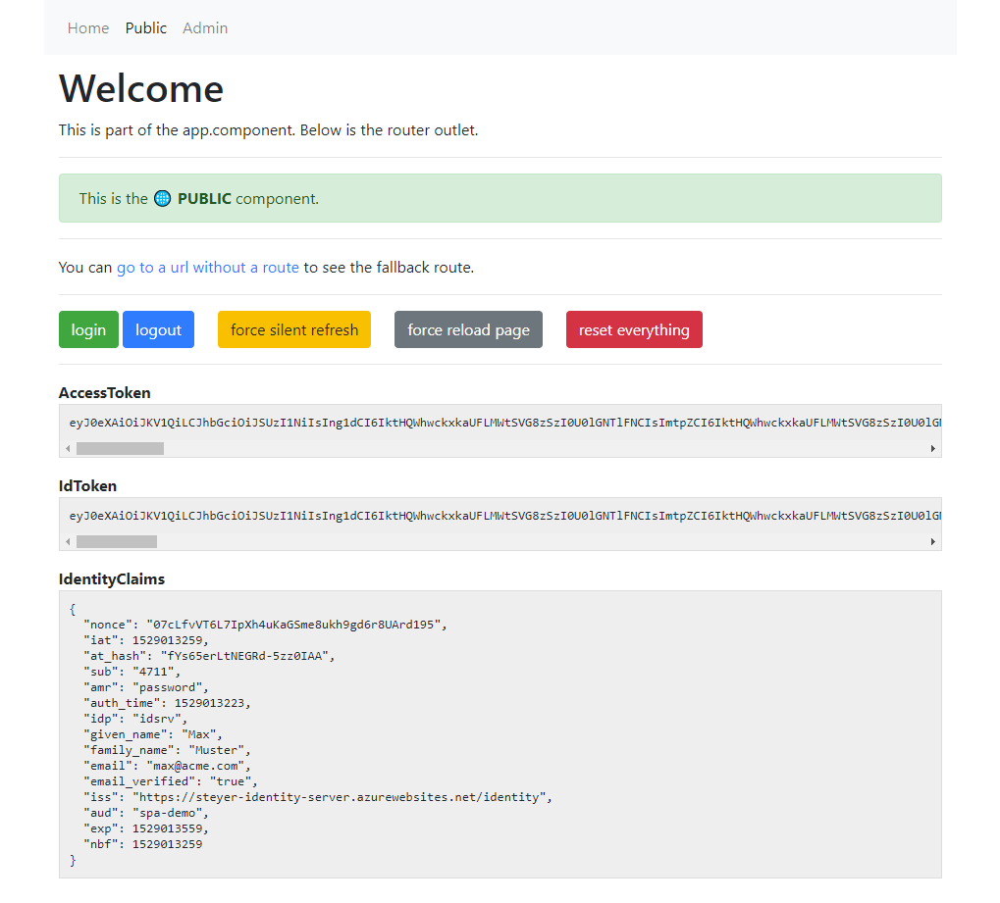

# Example angular-oauth2-oidc with AuthGuard

This repository shows a basic Angular CLI application with [the `angular-oauth2-oidc` library](https://github.com/manfredsteyer/angular-oauth2-oidc) and Angular AuthGuards.

## Features

This demonstrates:

- Use of **the Implicit Flow**, see [#24 for Code Flow](https://github.com/jeroenheijmans/sample-angular-oauth2-oidc-with-auth-guards/issues/24) support
- Modules (core, shared, and two feature modules)
- An auth guard that forces you to login when navigating to protected routes
- An auth guard that just prevents you from navigating to protected routes
- Asynchronous loading of login information (and thus async auth guards)
- Using `localStorage` for storing tokens (use at your own risk!)
- Loading IDS details from its discovery document
- Trying silent refresh on app startup before potientially starting a login flow
- OpenID's external logout features

Most interesting features can be found in [the core module](./src/app/core).

## Usage

This repository has been scaffolded with the Angular 5 CLI, then later upgraded to newer versions of the Angular CLI.
To use the repository:

1. Clone this repository
1. Run `npm install` to get the dependencies
1. Run `ng serve --open` to get it running on [http://localhost:4200](http://localhost:4200)

This connects to the [demo IdentityServer4 instance](https://demo.identityserver.io/) also used in the library's examples.
The **credentials** and ways of logging in are disclosed on the login page itself (as it's only a demo server).

You could also connect to your own IdentityServer by changing `auth-config.ts`.
Note that your server must whitelist both `http://localhost:4200/index.html` and `http://localhost:4200/silent-refresh.html` for this to work.

## Example

The application is supposed to look somewhat like this:

